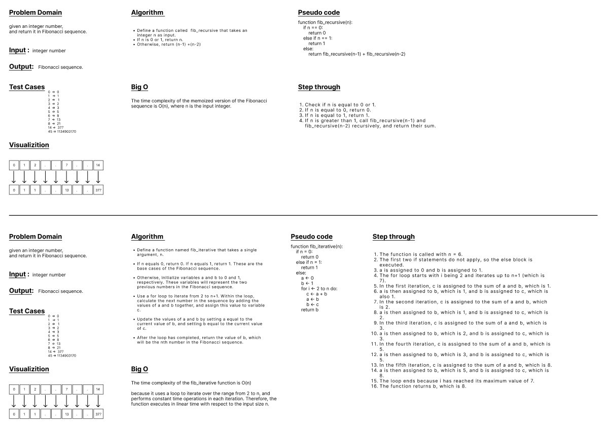

## fibonacciSequence
* Code Challenge 4 (Mock Interviews)
---
 

### Generate the nth Fibonacci number, 2 different ways.
### write a python function to accepts an integer, and returns the nth number in the Fibonacci sequence.
- You should be able to check their work for small values of n: if fib(n) is equal to fib(n-1) + fib(n-2)
- a first solution, that is either recursive or iterative (with a while or for loop).
- solve it with the other approach (eg: if they first used an iterative solution, ask for a recursive solution)
- Avoid utilizing any of the built-in methods available to your language.

 

