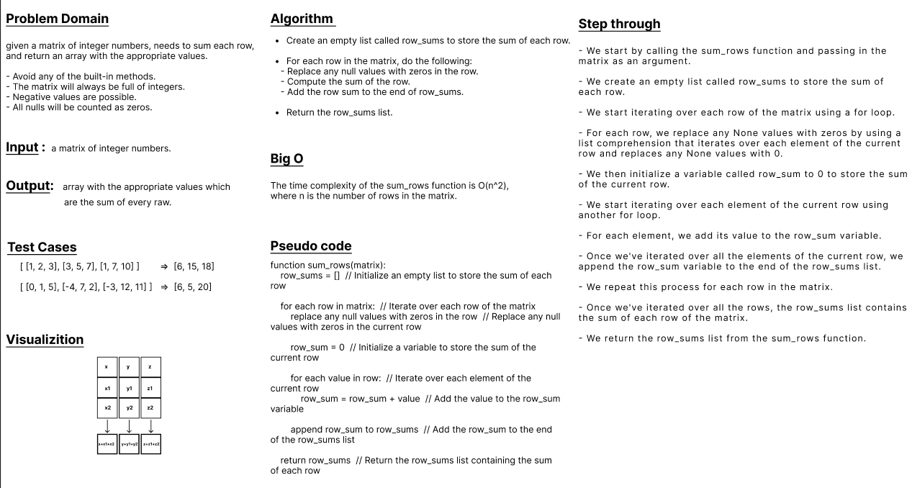

## matrixSum
* Code Challenge 4 (Mock Interviews)
---
 

### write a python function to add up the sum of each row in a matrix of arbitrary size, and return an array with the appropriate values.
- Avoid utilizing any of the built-in methods available to your language.
- The matrix will always be full of integers.
- Negative values are possible.
- All nulls will be counted as zeros.

 

