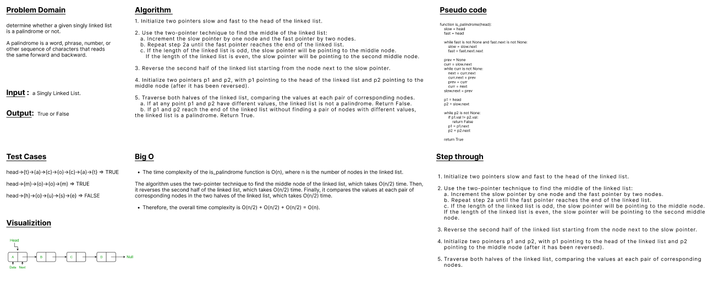

## Palindrome Linked List
* Code Challenge 9 (Mock Interviews)
---
 

### write a function to validate whether or not a Linked list is palindrome
### understand the definition of a Palindrome.
- A <strong>palindrome</strong> is a word, phrase, number, or sequence of nodes which reads the same backward as forward.

### Avoid utilizing any of the built-in methods available in your language.
 

### This problem can be approached in several ways:

<ul>

<li>
Using a helper data structure (Array or Linked List) to keep track of the nodes.

<ul>
<li>This method takes O(n) and uses O(n) extra space.
</li>

</ul>
</li>

<li> 
Reversing the Linked List, and checking for equality of the reversed part.
</li>

</ul>

---
 

### WhiteBoard 

