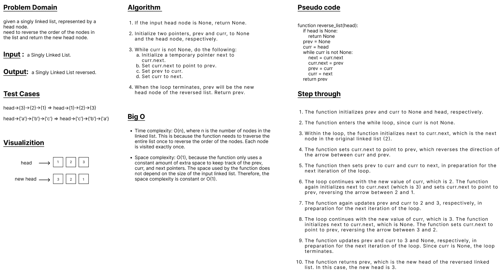

## Reverse Linked List
* Code Challenge 9 (Mock Interviews)
---
 

### write a function to reverse a Singly Linked List.
### Avoid utilizing any of the built-in methods available in your language.
### avoid creating a copy of the Linked List.
 

### This problem can be approached in several ways:

<ul>

<li>
Iterating over the linked list and storing a reference to a current node, its previous node, and its next node.

<ul>
<li>In every iteration, after the next node is stored, the current’s node next pointer is pointed at the stored reference to the previous node.</li>
<li>This solution takes O(n) time and uses O(1) extra space.</li>

</ul>
</li>

<li>A recursive solution that reverses the body of the link list before re-connecting the head.

<ul>
<li>This solution takes O(n) time and uses O(n) space on the call stack.</li>

</ul>
</li>

<li>Creating a copy of the linked list, inserting elements at the head of the new list.

<ul>
<li>This solution takes O(n) time and uses O(n) space.</li>

</ul>
</li>

</ul>

---
 

### WhiteBoard 

