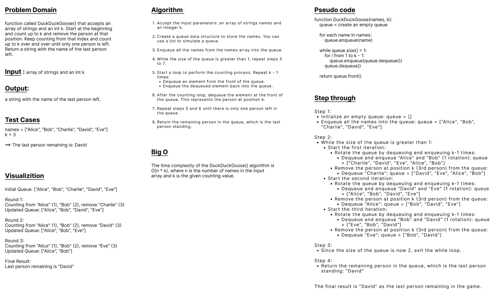

## Duck Duck Goose
* Code Challenge 14 (Mock Interviews)
---
 

#### Write a function called DuckDuckGoose() that accepts an array of strings and an int k. Start at the beginning and count up to k and remove the person at that position. Keep counting from that index and count up to k over and over until only one person is left. Return a string with the name of the last person left.

#### This problem can be solved using a queue:
#### One solution is to enqueue and dequeue k number of times. Once k is hit, skip the enqueue process for that entry, removing it from the queue. Repeat until there is only 1 node in the queue remaining.
#### This method takes O(n * k) time and uses O(n) (linear) space during this process.
---
 

### WhiteBoard 

