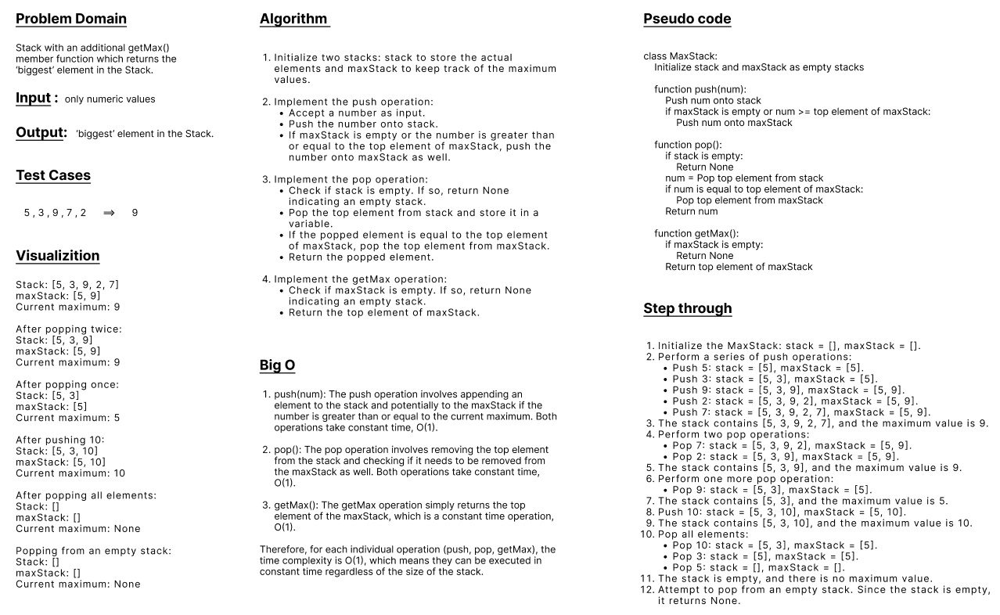

## Max Stack
* Code Challenge 14 (Mock Interviews)
---
 

#### write a ‘Max Stack’ which is defined as a Stack with an additional getMax() member function which returns the ‘biggest’ element in the Stack.
#### only numeric values will be stored in the Stack.
#### This ‘getMax()’ member function can be approached in several ways as well:
- Modifying the traditional push and pop methods to keep track on the maximum value so far.
- Use a maxStack instance variable, and each time you push a number, you check if it’s >= the peek on maxStack; if so, push it onto both maxStack and the actual stack. Then when popping, check if equal to max on maxStack, and if so, also pop maxStack.
    - This solution takes O(1) time to both maintain and retrieve the maximum value.

- Traversing the entire Stack to calculate the maximum value.
    - This solution takes O(n) time.
    - If the candidate is considering this approach, comment on the fact that there might be a more efficient way to calculate the maximum value, but avoid providing specific details.

---
 

### WhiteBoard 

