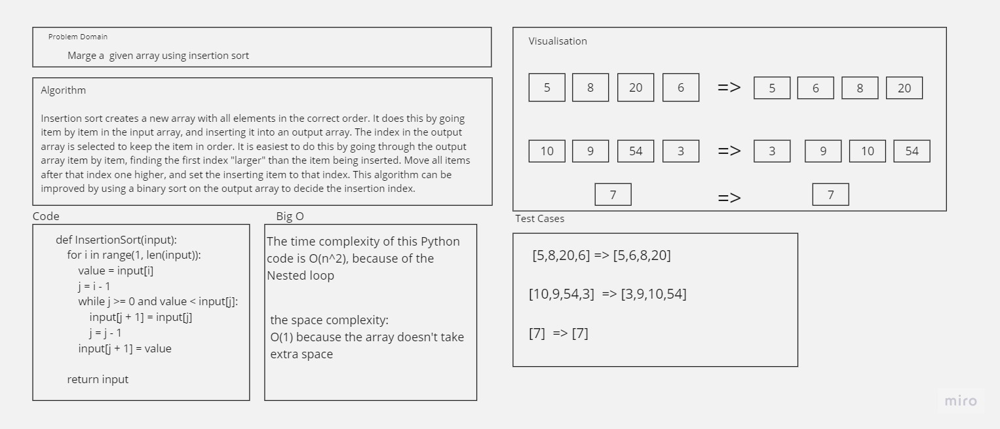

## Insertion Sort

 

### Feature Tasks
- write a function to implement insertion sort.
- Avoid utilizing any of the built-in sort methods available in your language
- Offer an example input array of positive and negative integers.
- describe the properties of the algorithm they implement

 

### WhiteBoard
 

