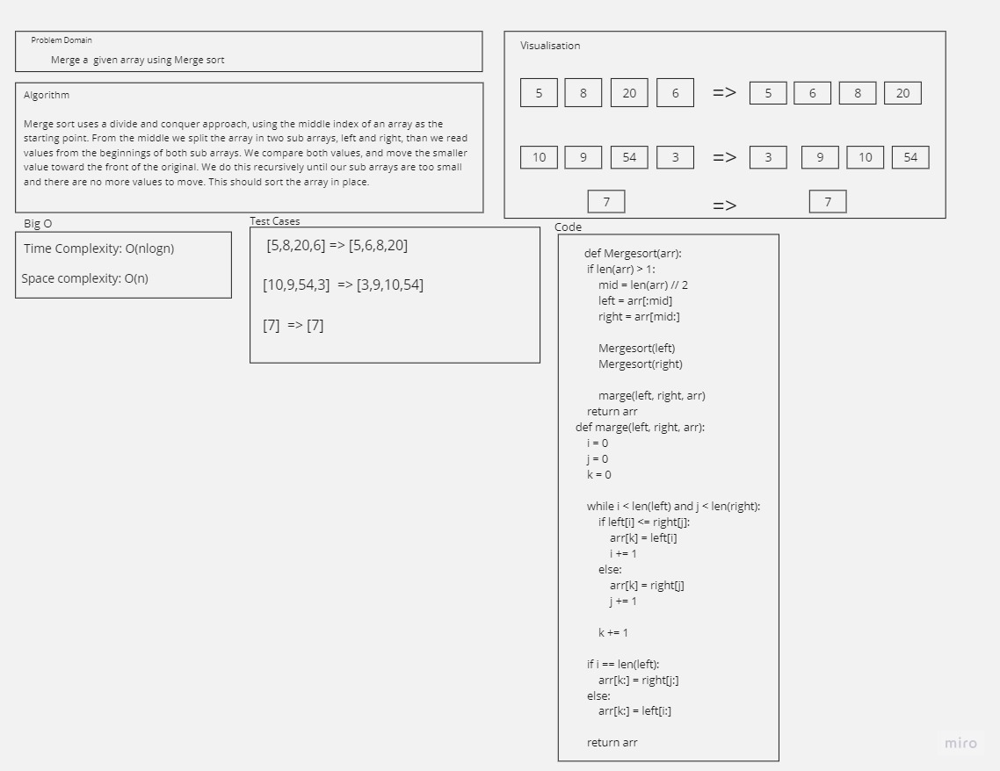

## Merge Sort

 

### Feature Tasks
- write a function to implement a mergesort.
- Avoid utilizing any of the built-in methods available in your language.
- Offer an example input array of positive and negative integers.
- Encourage a recursive solution, for elegance. Iterative solutions are possible.

 

### WhiteBoard 
 

