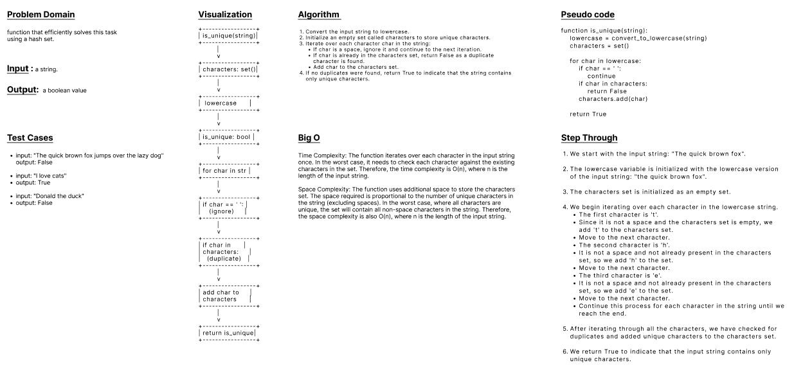

## Unique String

 

### Feature Tasks:
- write a function that will determine if the given string is full of unique characters.
- We can assume that spaces don’t count, and the characters are not case sensitive (i.e. “A” is the same as “a”).
- The most efficient solution is going to use a Hashmap. The candidate should iterate through the string. and for each of the characters put them in the Hashset, if the value already exists, they can return false as soon as a duplicate occurs.
- We can assume they have a Hashset readily available (they do not have to implement one).
- This solution is of an O(n) time and O(n) space.

 

### Stretch Goal
- If they solve this question too quickly, increase the difficulty by saying that the sentence is case sensitive. (i.e. “A” and “a” are not the same. )

 

### Example

| Input                                       | Output |
|  ---                                        | ---    |
| The quick brown fox jumps over the lazy dog | FALSE  |
| I love cats	                              | TRUE   |
| Donald the duck                             | FALSE  |

 

### WhiteBoard 
 

 