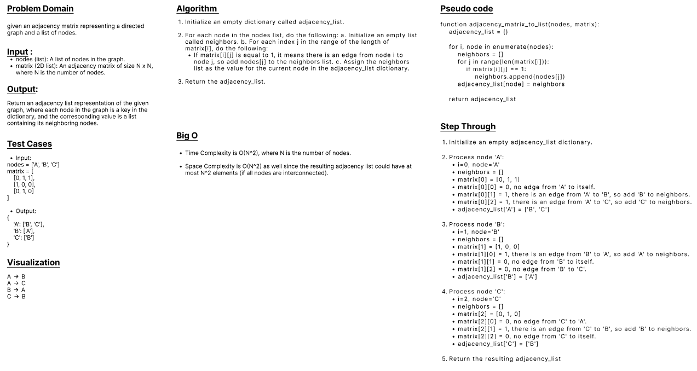

## Graph Adjacency List

#### Given an adjacency matrix representation of a graph, return the adjacency list representation.
<br>

### Feature Tasks
- Give the candidate an example of what the adjacency matrix could look like (see below for example).
- The input will be an array of nodes and a 2D array of booleans.
    - The 2D array has the same number of elements as the array of nodes, as do the sub-arrays.
    - Each index in the 2D array will therefore map to an index in the array of nodes (which can then be used as a reference for the node).
- The candidate will want to use a nested for loop to iterate through the matrix and determine from there what vertices connect to others.
- To assist in the construction of the adjacency list, each row of the matrix is going to be a separate node.
- for every 1 in that row, that is going to be a valid connection and can then be converted to the list for construction.

<br>

### Notes
- In the following example, the letters (“a” through “e”) are shown here to represent the values associated each node.
- The zeroes and ones are there to visually represent the presence of a connection (edge) between the 2 nodes.
    - While they are displayed as numbers in the drawing, these are not to be used as values within your algorithm, but as booleans
    - Assume actual boolean values (true, false) in your array.

<br>

### Input:
```
  Array 1: [ {a}, {b}, {c}, {d}, {e} ]

  Array 2:
  [
    [f, t, f, f, t],
    [t, f, t, t, f],
    [f, t, f, t, f],
    [f, t, t, f, t],
    [t, f, f, t, f]
  ]

  Visually, the matrix looks like this

    |  a  b  c  d  e
    ----------------
  a |  0  1  0  0  1
  b |  1  0  1  1  0
  c |  0  1  0  1  0
  d |  0  1  1  0  1
  e |  1  0  0  1  0
```
<br>

### Output:
```
a| -> b -> e

b|-> a -> c -> d

c| -> b -> d

d| -> b -> c -> e

e| -> a -> d
```
<br>

## WhiteBoard
