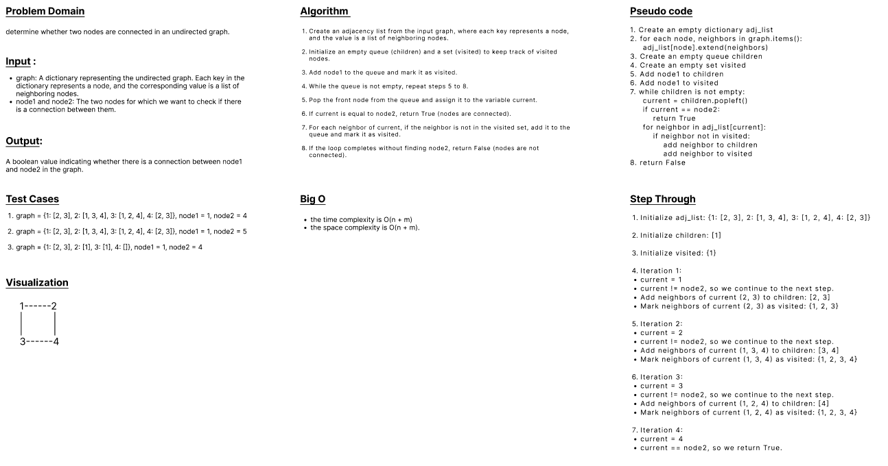

## Graph Connected Nodes

#### Given a graph, are 2 given nodes connected?

<br>

### Feature Tasks
- The candidate should write a function that accepts as input two nodes and a graph, represented as an adjacency list.
- The format of the adjacency list can be specified by the candidate.
    - Unless otherwise specified, assume the graph is a directed graph.

- The function should traverse the graph, using any traversal method.
- The traversal should start at one node, and continue until the second node is found, or the traversal is completed.
- The return type of this method will be boolean.

#### The candidate should be able to traverse from Node A to determine if Node B is connected.

<br>

### Input:

- Two nodes: Node D, Node G

- Graph:
    ```
    a| -> B -> C
    b| -> D -> A
    c| -> A -> D
    d| -> B -> C -> F
    e| -> F
    f| -> E -> G
    g| -> F
    ```

<br>

### Output:
- True

<br>

## WhiteBoard
