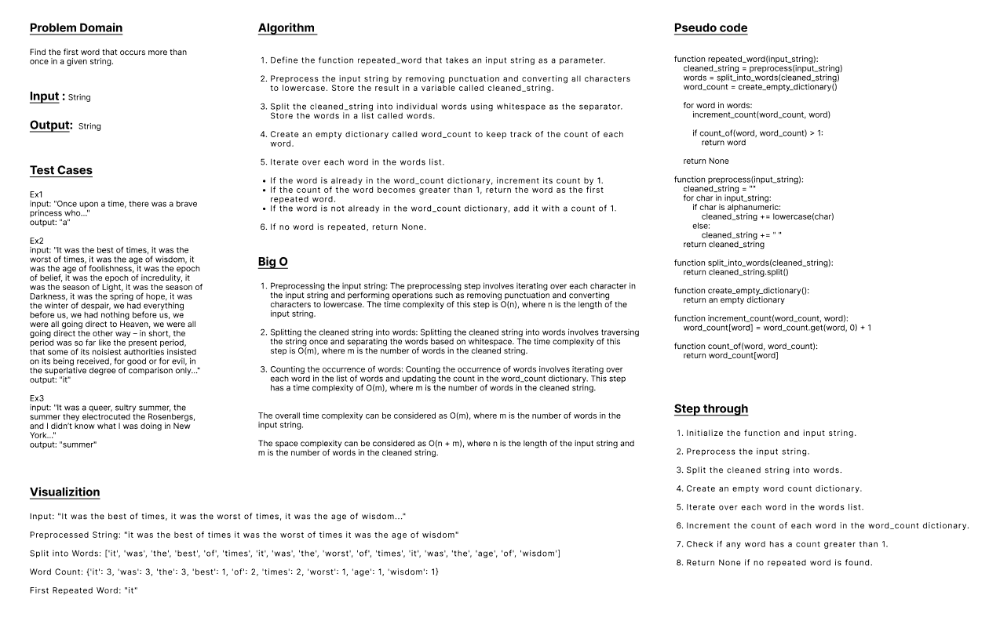
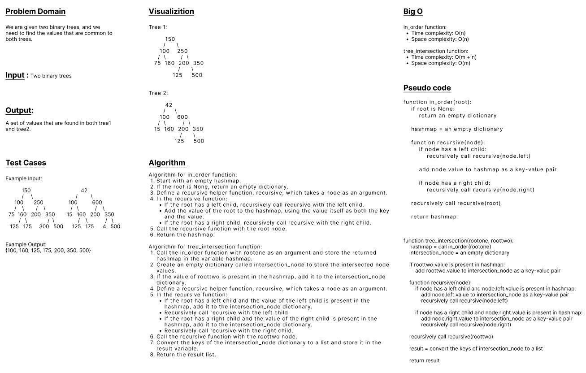

## Hash Tables
- Code Challenge 30 & 31 & 32

---

## Code Challenge 30

### Features

#### Implement a Hashtable Class with the following methods:

- set
    - Arguments: key, value
    - Returns: nothing
    - This method should hash the key, and set the key and value pair in the table, handling collisions as needed.
    - Should a given key already exist, replace its value from the value argument given to this method.

<br>

- get
    - Arguments: key
    - Returns: Value associated with that key in the table

<br>

- has
    - Arguments: key
    - Returns: Boolean, indicating if the key exists in the table already.

<br>

- keys
    - Returns: Collection of keys

<br>

- hash
    - Arguments: key
    - Returns: Index in the collection for that key


<br>
<br>


### Structure and Testing

#### Utilize the Single-responsibility principle: any methods you write should be clean, reusable, abstract component parts to the whole challenge. You will be given feedback and marked down if you attempt to define a large, complex algorithm in one function definition.

#### Be sure to follow your language/frameworks standard naming conventions (e.g. C# uses PascalCasing for all method and class names).

#### Any exceptions or errors that come from your code should be contextual, descriptive, capture-able errors. For example, rather than a default error thrown by your language, your code should raise/throw a custom error that describes what went wrong in calling the methods you wrote for this lab.
<br>

#### Write tests to prove the following functionality:

- Setting a key/value to your hashtable results in the value being in the data structure
- Retrieving based on a key returns the value stored
- Successfully returns null for a key that does not exist in the hashtable
- Successfully returns a list of all unique keys that exist in the hashtable
- Successfully handle a collision within the hashtable
- Successfully retrieve a value from a bucket within the hashtable that has a collision
- Successfully hash a key to an in-range value 

<br>

#### Ensure your tests are passing before you submit your solution.

<br>

---
<br>

## Code Challenge 31: hashmap-repeated-word

### Feature Tasks

- Write a function called repeated word that finds the first word to occur more than once in a string
- Arguments: string
- Return: string

<br>
<br>

### Structure and Testing

#### Utilize the Single-responsibility principle: any methods you write should be clean, reusable, abstract component parts to the whole challenge. You will be given feedback and marked down if you attempt to define a large, complex algorithm in one function definition.

#### Write at least three test assertions for each method that you define.

#### Ensure your tests are passing before you submit your solution.

<br>
<br>


### Examples

- Ex1
    - input: "Once upon a time, there was a brave princess who..."	
    - output: "a"

<br>

- Ex2
    - input: "It was the best of times, it was the worst of times, it was the age of wisdom, it was the age of foolishness, it was the epoch of belief, it was the epoch of incredulity, it was the season of Light, it was the season of Darkness, it was the spring of hope, it was the winter of despair, we had everything before us, we had nothing before us, we were all going direct to Heaven, we were all going direct the other way – in short, the period was so far like the present period, that some of its noisiest authorities insisted on its being received, for good or for evil, in the superlative degree of comparison only..."	
    - output: "it"

<br>

- Ex3
    - input: "It was a queer, sultry summer, the summer they electrocuted the Rosenbergs, and I didn’t know what I was doing in New York..."
    - output: "summer"


<br>
<br>

## WhiteBoard



<br>

---
<br>

## Code Challenge 32
- [Intersection](./intersection.py)

<br>

### Feature Tasks

- Write a function called tree_intersection that takes two binary trees as parameters.
- Using your Hashmap implementation as a part of your algorithm, return a set of values found in both trees

<br>

### Structure and Testing
- Utilize the Single-responsibility principle: any methods you write should be clean, reusable, abstract component parts to the whole challenge. You will be given feedback and marked down if you attempt to define a large, complex algorithm in one function definition.

- Write at least three test assertions for each method that you define.

<br>

### Example
<br>

- Input:
    ```
                  150
                /     \
             100       250
            /   \      /  \
          75    160  200   350
                /  \       /  \
              125  175   300   500
    ```
    <br>

    ```
                   42
                /     \
             100       600
            /   \      /  \
          15    160  200   350
                /  \       /  \
              125  175    4   500
    ```

<br>

- Output:
```
100,160,125,175,200,350,500
```

<br>
<br>


### WhiteBoard



<br>

---
<br>

**- Esmail Jawabreh**