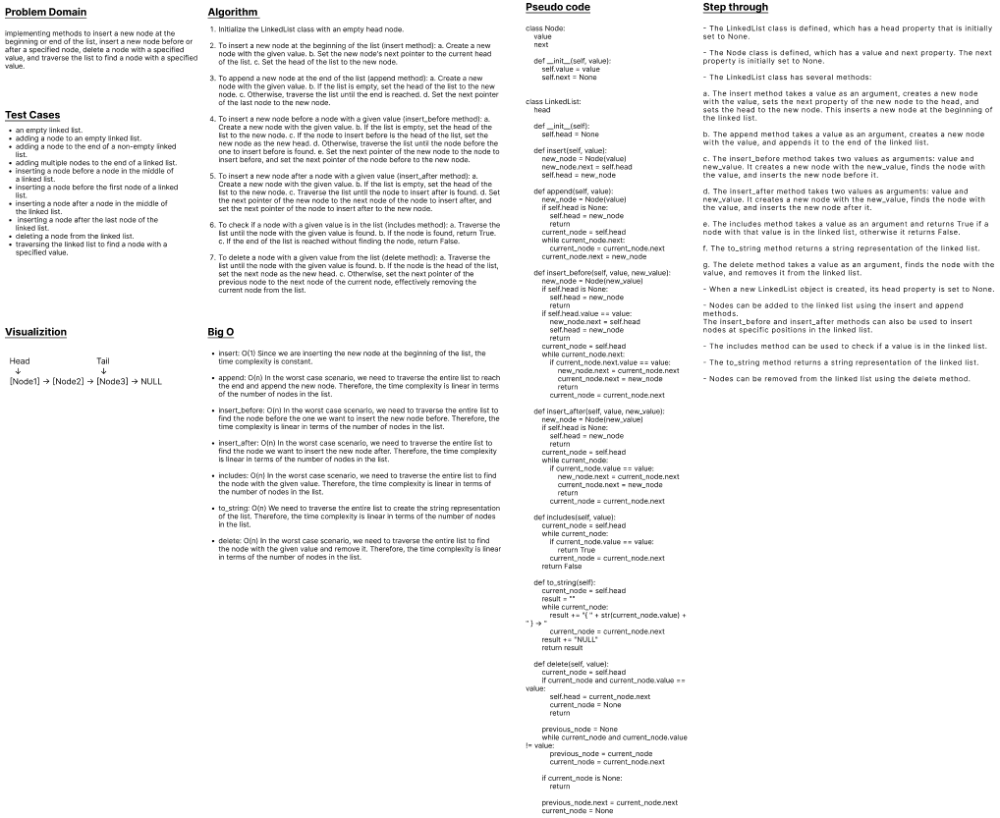
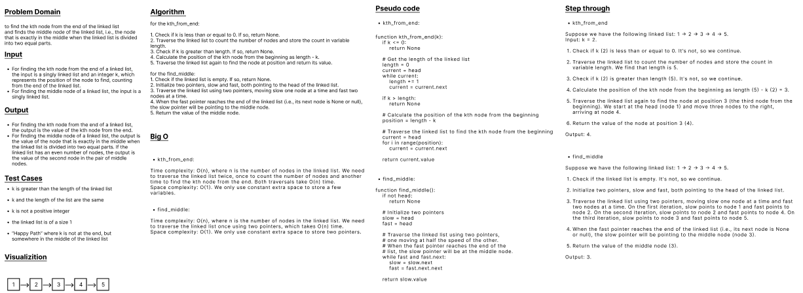
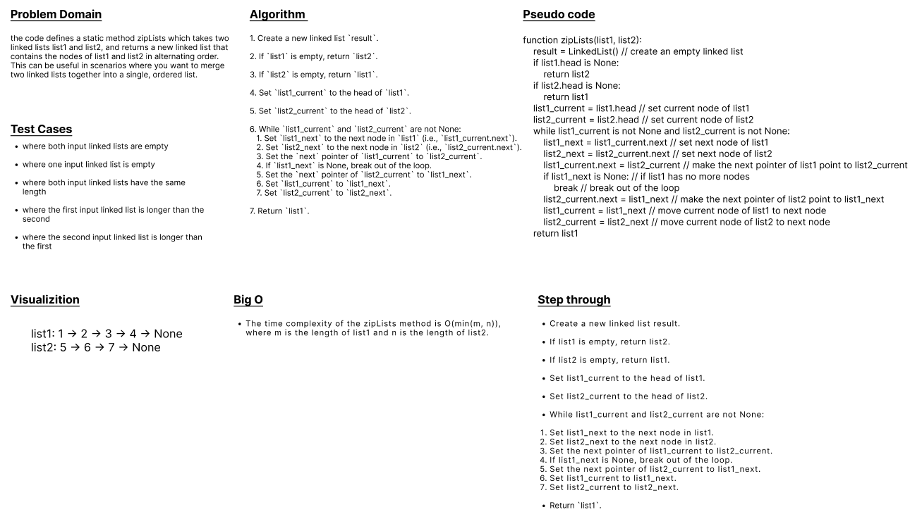

## Linked Lists
- Code Challenge 05 & 06 & 07 & 08

---

#### Challenge Type: Implementation
#### Challenge Instruction: 
 

## Challenge 05
### Features:

#### Node: 
- Create a Node class that has properties for the value stored in the Node, and a pointer to the next Node.

#### Linked List: 

<ul>
<li>Create a Linked List class</li>
<li>Within your Linked List class, include a head property.</li>
<li>Upon instantiation, an empty Linked List should be created.</li>
 
<li>The class should contain the following methods</li>
<ul>
<li>insert</li>
<ul>
<li>Arguments: value</li>
<li>Returns: nothing</li>
<li>Adds a new node with that value to the head of the list with an O(1) Time performance.</li>
</ul>
 
<li>includes</li>
<ul>
<li>Arguments: value</li>
<li>Returns: Boolean</li>
<li>Indicates whether that value exists as a Node’s value somewhere within the list.</li>
</ul>
 
<li>to string</li>
<ul>
<li>Arguments: none</li>
<li>Returns: a string representing all the values in the Linked List, formatted as: <strong>"{ a } -> { b } -> { c } -> NULL"</strong>
</li>
</ul>
</ul>
</ul>

 

### Structure and Testing:

#### Utilize the Single-responsibility principle: any methods you write should be clean, reusable, abstract component parts to the whole challenge. You will be given feedback and marked down if you attempt to define a large, complex algorithm in one function definition.

#### Be sure to follow your language/frameworks standard naming conventions (e.g. C# uses PascalCasing for all method and class names).

#### Any exceptions or errors that come from your code should be contextual, descriptive, capture-able errors. For example, rather than a default error thrown by your language, your code should raise/throw a custom error that describes what went wrong in calling the methods you wrote for this lab.
 

#### Write tests to prove the following functionality:

<ul>
<li>Can successfully instantiate an empty linked list</li>
<li>Can properly insert into the linked list</li>
<li>The head property will properly point to the first node in the linked list</li>
<li>Can properly insert multiple nodes into the linked list</li>
<li>Will return true when finding a value within the linked list that exists</li>
<li>Will return false when searching for a value in the linked list that does not exist</li>
<li>Can properly return a collection of all the values that exist in the linked list</li>
</ul>
 

 

### Stretch Goal:

#### Create a new branch called <strong>doubly-linked-list</strong>, and, using the resources available to you online, implement a doubly linked list (completely separate from your singly linked list).
 

---
 

## Challenge 06
### Feature:
#### Write the following methods for the Linked List class:
<ul>

<li>append</li>
<ul>
<li>arguments: new value</li>
<li>adds a new node with the given value to the end of the list</li>
</ul>

<li>insert before</li>
<ul>
<li>arguments: value, new value</li>
<li>adds a new node with the given new value immediately before the first node that has the value specified</li>
</ul>

<li>insert after</li>
<ul>
<li>arguments: value, new value</li>
<li>adds a new node with the given new value immediately after the first node that has the value specified</li>
</ul>

</ul>

 

### Unit Tests:

#### tests to prove the following functionality:

- Can successfully add a node to the end of the linked list
- Can successfully add multiple nodes to the end of a linked list
- Can successfully insert a node before a node located i the middle of a linked list
- Can successfully insert a node before the first node of a linked list
- Can successfully insert after a node in the middle of the linked list
- Can successfully insert a node after the last node of the linked list

 

### Stretch Goal:

#### write an additional method to delete a node with the given value from the linked list.

 

## WhiteBoard

 

---
 

## Challenge 07
### Feature:

#### Write the following method for the Linked List class:

- kth from end
- argument: a number, k, as a parameter.
- Return the node’s value that is k places from the tail of the linked list.
- You have access to the Node class and all the properties on the Linked List class as well as the methods created in previous challenges.

 

### Unit Tests:

#### Write tests for the following scenarios, and any other cases that help you ensure your code is working as expected.

- Where k is greater than the length of the linked list
- Where k and the length of the list are the same
- Where k is not a positive integer
- Where the linked list is of a size 1
- “Happy Path” where k is not at the end, but somewhere in the middle of the linked list

 

### Stretch Goal:
#### Once you’ve achieved a working solution, implement a method that finds the node at the middle of the Linked List.

 

## WhiteBoard

 

---
 

## Challenge 08
### Feature:
- Write a function called zip lists
- Arguments: 2 linked lists
- Return: New Linked List, zipped as noted below
- Zip the two linked lists together into one so that the nodes alternate between the two lists and return a reference to the the zipped list.
- Try and keep additional space down to O(1)
- You have access to the Node class and all the properties on the Linked List class as well as the methods created in previous challenges.

 

### Unit Tests

#### On this, and all future challenges, write tests for any cases that help you ensure your code is working as expected. Think through different edge cases to determine what tests will ensure your code is covered.

 

### Stretch Goal
#### Once you’ve achieved a working solution, implement another function that merges two sorted linked lists into a single sorted linked list.

 

## WhiteBoard

 

---
 

**- Esmail Jawabreh**