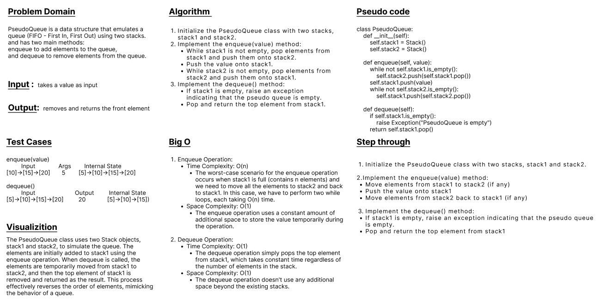
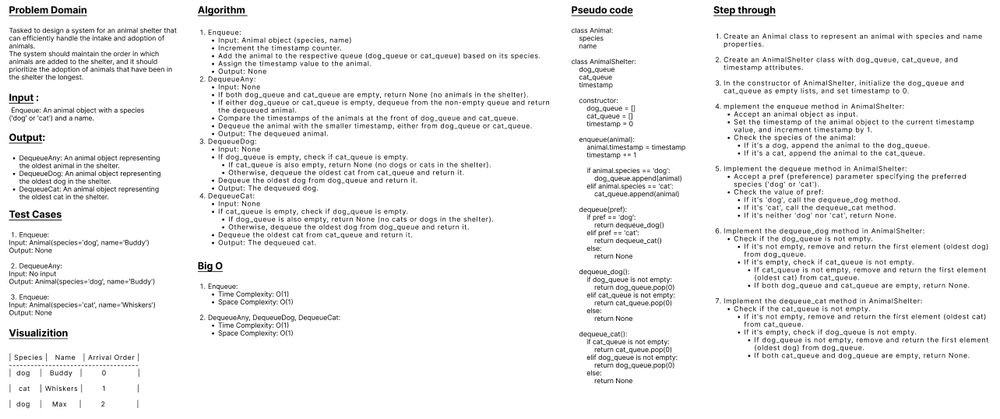
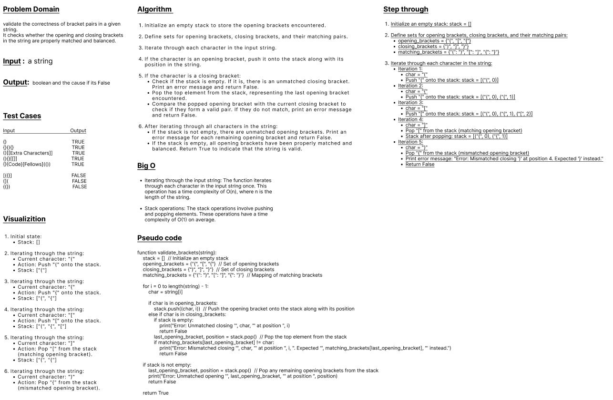

## stack-and-queue
* Code Challenge 10 & 11 & 12 & 13 
---
 

## Code Challenge 10
### Features
#### Using a Linked List as the underlying data storage mechanism, implement both a Stack and a Queue (Python)
 

### Node:
#### Create a Node class that has properties for the value stored in the Node, and a pointer to the next node.
 

### Stack:
#### Create a Stack class that has a top property. It creates an empty Stack when instantiated.
#### This object should be aware of a default empty value assigned to top when the stack is created.
 

#### The class should contain the following methods:
- push
#### Arguments: value
#### adds a new node with that value to the top of the stack with an O(1) Time performance.

- pop
#### Arguments: none
#### Returns: the value from node from the top of the stack
#### Removes the node from the top of the stack
#### Should raise exception when called on empty stack

- peek
#### Arguments: none
#### Returns: Value of the node located at the top of the stack
#### Should raise exception when called on empty stack

- is empty
#### Arguments: none
#### Returns: Boolean indicating whether or not the stack is empty.
 

### Queue:
#### Create a Queue class that has a front property. It creates an empty Queue when instantiated.
#### This object should be aware of a default empty value assigned to front when the queue is created.
 

#### The class should contain the following methods:
- enqueue
#### Arguments: value
#### adds a new node with that value to the back of the queue with an O(1) Time performance.

- dequeue
#### Arguments: none
#### Returns: the value from node from the front of the queue
#### Removes the node from the front of the queue
#### Should raise exception when called on empty queue

- peek
#### Arguments: none
#### Returns: Value of the node located at the front of the queue
#### Should raise exception when called on empty stack

- is empty
#### Arguments: none
#### Returns: Boolean indicating whether or not the queue is empty
---
 

### Structure and Testing

#### Write tests to prove the following functionality:

- Can successfully push onto a stack
- Can successfully push multiple values onto a stack
- Can successfully pop off the stack
- Can successfully empty a stack after multiple pops
- Can successfully peek the next item on the stack
- Can successfully instantiate an empty stack
- Calling pop or peek on empty stack raises exception
- Can successfully enqueue into a queue
- Can successfully enqueue multiple values into a queue
- Can successfully dequeue out of a queue the expected value
- Can successfully peek into a queue, seeing the expected value
- Can successfully empty a queue after multiple dequeues
- Can successfully instantiate an empty queue
- Calling dequeue or peek on empty queue raises exception

 

---
 

## Code Challenge 11
### Feature 
#### Create a new class called pseudo queue.
#### Do not use an existing Queue.
#### Instead, this PseudoQueue class will implement our standard queue interface (the two methods listed below),
#### Internally, utilize 2 Stack instances to create and manage the queue
#### Methods:
- enqueue
##### Arguments: value
##### Inserts a value into the PseudoQueue, using a first-in, first-out approach.
- dequeue
##### Arguments: none
##### Extracts a value from the PseudoQueue, using a first-in, first-out approach.
 

#### NOTE: The Stack instances have only push, pop, and peek methods. You should use your own Stack implementation. Instantiate these Stack objects in your PseudoQueue constructor.
 

### WhiteBoard

 

---
 

## Code Challenge 12
- First-in, First out Animal Shelter.

### Feature Tasks
#### Create a class called AnimalShelter which holds only dogs and cats.
#### The shelter operates using a first-in, first-out approach.
#### Implement the following methods:

<ul>

<li>enqueue
<ul>
<li>Arguments: animal
<ul>
<li>animal can be either a dog or a cat object.</li>
<li>It must have a species property that is either "cat" or "dog"</li>
<li>It must have a name property that is a string.</li>
</ul>
</li>
</ul>
</li>

<li>dequeue
<ul>
<li>Arguments: pref
<ul>
<li>pref can be either "dog" or "cat"</li>
</ul>
</li>

<li>Return: either a dog or a cat, based on preference.
<ul>
<li>If pref is not "dog" or "cat" then return null.</li>
</ul>
</li>
</ul>
</li>

</ul>
 

### Stretch Goal
#### If a cat or dog isn’t preferred, return whichever animal has been waiting in the shelter the longest.

 

### WhiteBoard

 

---
 

## Code Challenge 13
### Feature Tasks
#### Write a function called validate brackets
- Arguments: string
- Return: boolean
    - representing whether or not the brackets in the string are balanced

#### There are 3 types of brackets:
- Round Brackets : ()
- Square Brackets : []
- Curly Brackets : {}

 

### Example
|Input                      |Output |
| ---                       | ---   |
| {}	                    | TRUE  |
| {}(){}	                | TRUE  |
| ()[[Extra Characters]]	| TRUE  |
| (){}[[]]	                | TRUE  |
| [({}]	                    | FALSE |
| (](	                    | FALSE |
| {(})	                    | FALSE |
 

#### Consider these small examples and why they fail.

|Input | Output	 | Why                                                    |
| ---  | ---     | ---                                                    |
|{	   | FALSE	 | error unmatched opening { remaining.                   |
|)	   | FALSE	 | error closing ) arrived without corresponding opening. |
|[}	   | FALSE	 | error closing }. Doesn’t match opening (.              |
 

### WhiteBoard

 
---
 

**- Esmail Jawabreh**