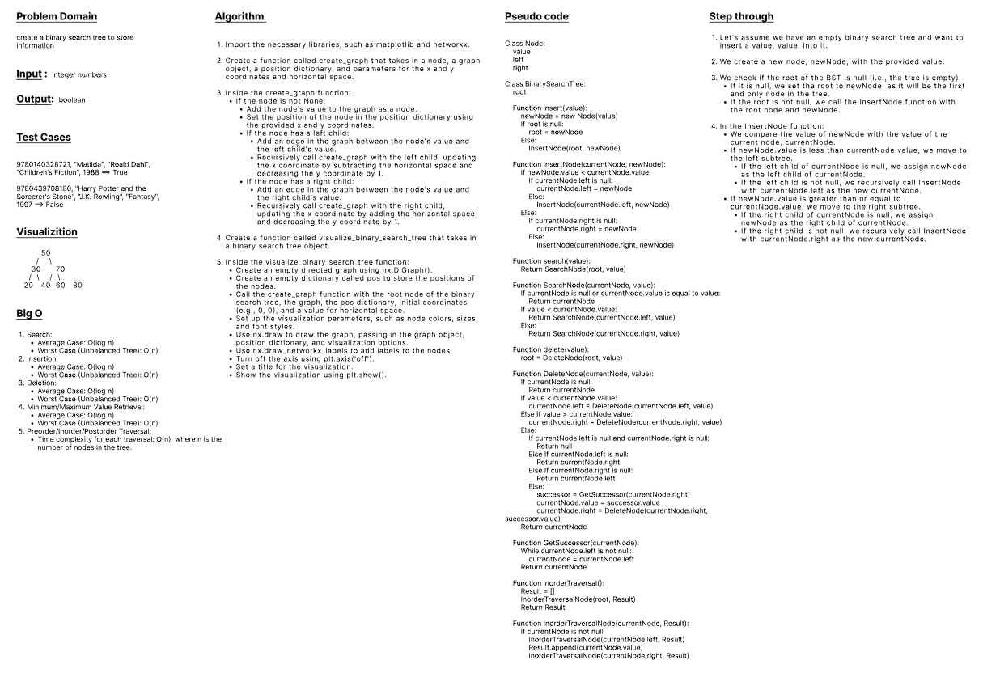
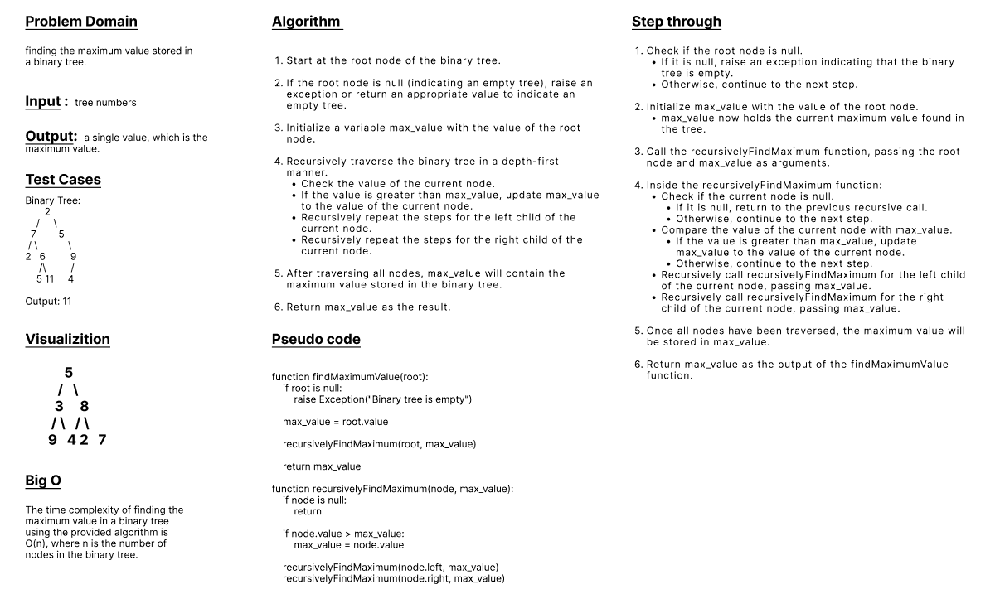
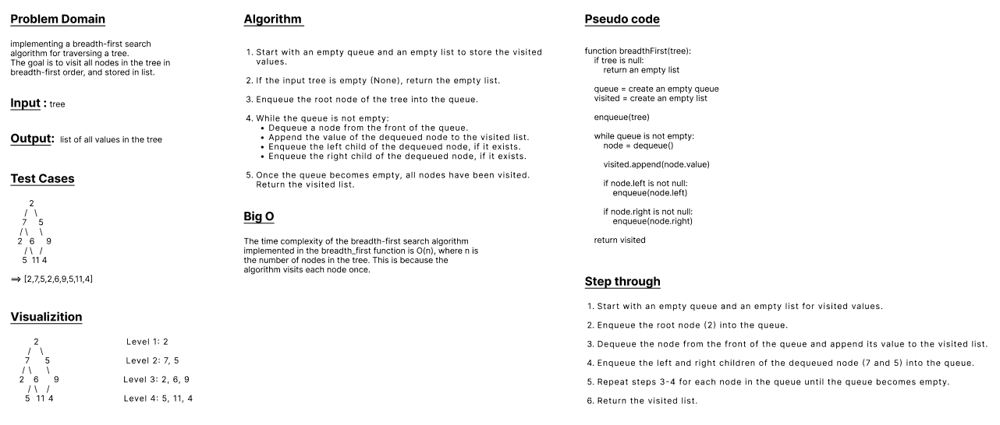

## Trees
- Code Challenge 15 & 16 & 17

<br>

---
<br>

## Code Challenge 15
- [Binary Tree](./binaryTree.py)
- [Binary Search Tree](./binarySearchTree.py)

<br>

### Features
<br>

- Node
    - Create a Node class that has properties for the value stored in the node, the left child node, and the right child node.

- Binary Tree
    - Create a Binary Tree class
        - Define a method for each of the depth first traversals:
            - pre order
            - in order
            - post order

    - Each depth first traversal method should return an array of values, ordered appropriately.

<br>

- Binary Search Tree
    - Create a Binary Search Tree class
        - This class should be a sub-class (or your languages equivalent) of the Binary Tree Class, with the following additional methods:
        - Add
            - Arguments: value
            - Return: nothing
            - Adds a new node with that value in the correct location in the binary search tree.
        - Contains
            - Argument: value
            - Returns: boolean indicating whether or not the value is in the tree at least once.

<br>
<br>

### Tests 
<br>

- Can successfully instantiate an empty tree
- Can successfully instantiate a tree with a single root node
- For a Binary Search Tree, can successfully add a left child - and right child properly to a node
- Can successfully return a collection from a pre-order traversal
- Can successfully return a collection from an in-order traversal
- Can successfully return a collection from a post-order traversal
- Returns true	false for the contains method, given an existing or non-existing node value

<br>

### WhiteBoard


<br>

---
<br>

## Code Challenge 16
- [Maximum Value](./maximumValue.py)

<br>

### Feature Tasks

#### Write the following method for the Binary Tree class

- find maximum value
    - Arguments: none
    - Returns: number

<br>

- Find the maximum value stored in the tree. You can assume that the values stored in the Binary Tree will be numeric.

<br>

### WhiteBoard


<br>

---
<br>

## Code Challenge 17
- [Breadth First](./breadthFirst.py)

<br>

### Feature Tasks
- Write a function called breadth first
- Arguments: tree
- Return: list of all values in the tree, in the order they were encountered

<br>

#### Example: 
```
     2
   /   \
  7      5
 / \      \
2   6      9
   / \     /
  5  11   4
```   

#### Output:
```
[2,7,5,2,6,9,5,11,4]
```

<br>

### WhiteBoard


<br>

---
<br>